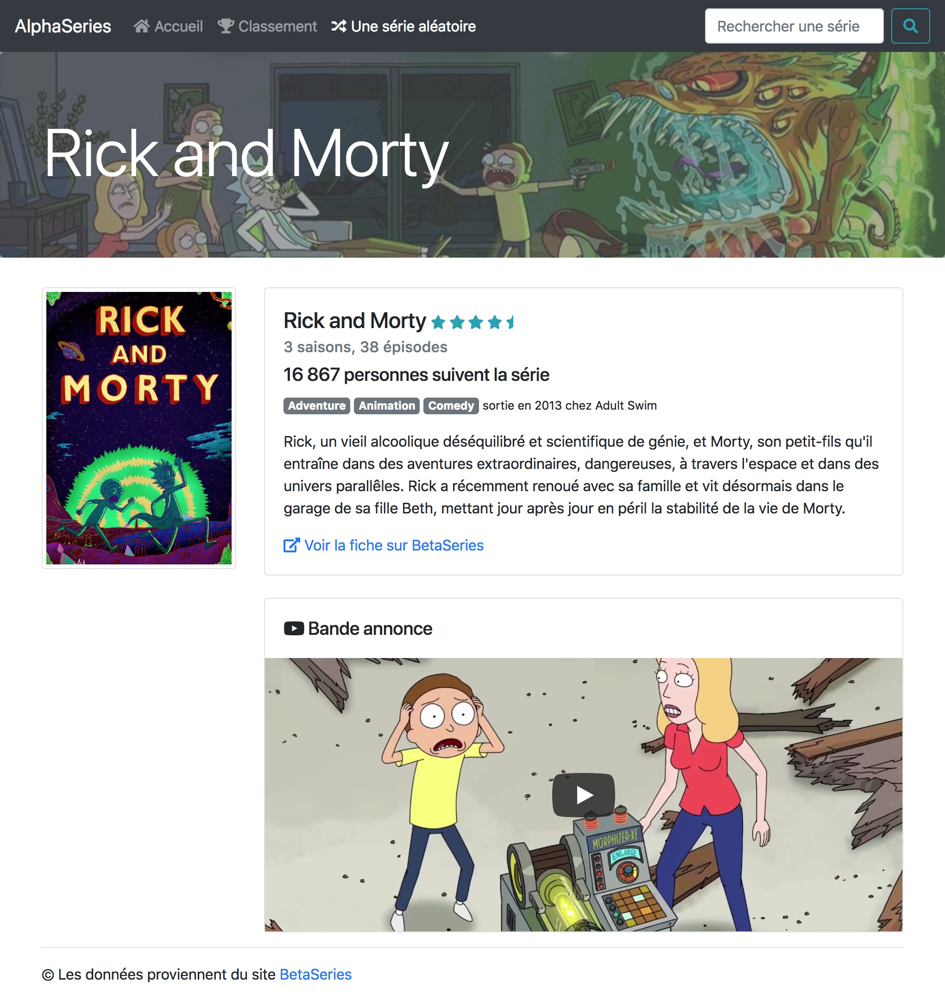
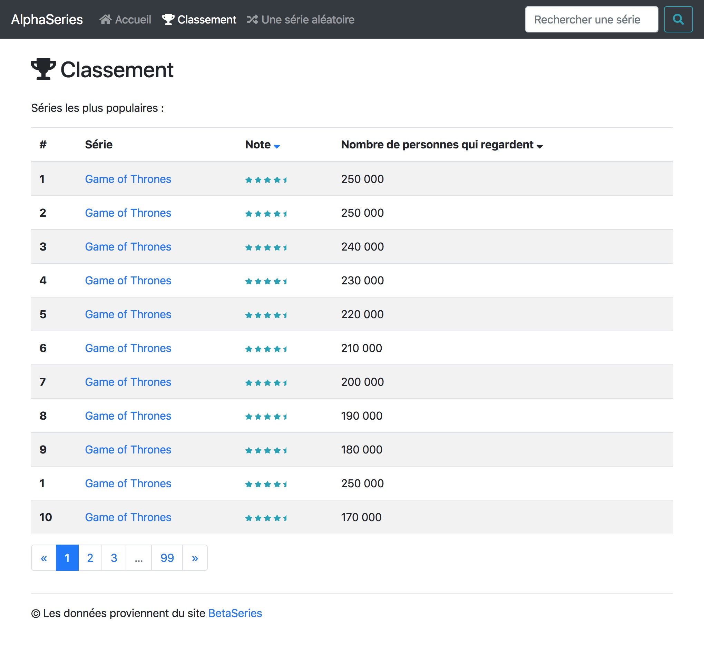
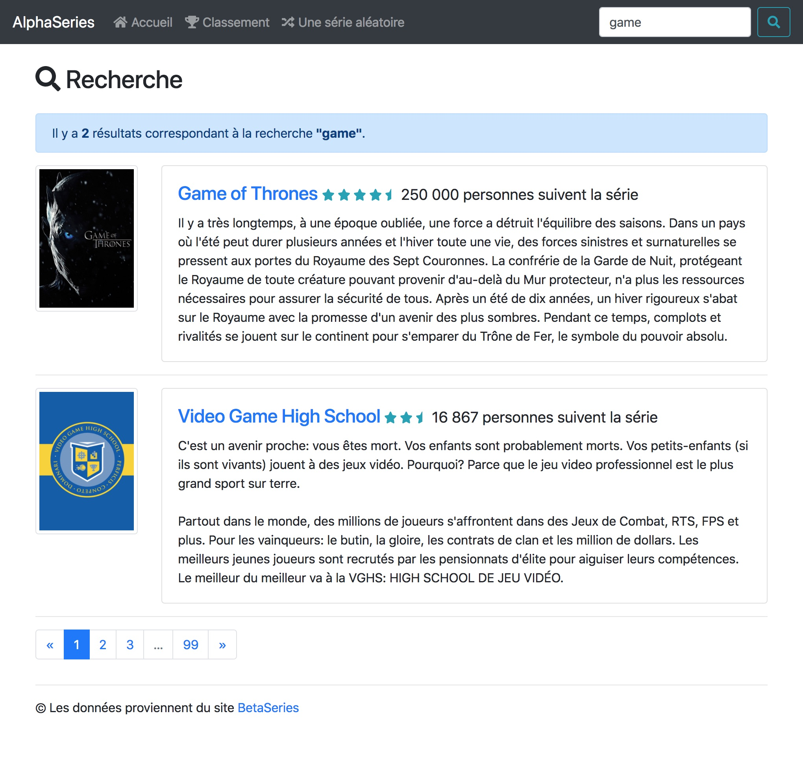

# Challenge AlphaSeries

**Veuillez bien lire toutes les consignes avec attention.**

* [Objectif](#objectif)
* [Comment faire ?](#comment-faire-)
* [Fonctions utiles](#fonctions-utiles)
* [Les données](#les-données)
* [Les pages à réaliser](#les-pages-à-réaliser)
    * [La page d'accueil](#la-page-accueil)
    * [La page série](#la-page-série)
    * [La série aléatoire](#la-série-aléatoire)
    * [La page classement](#la-page-classement)
    * [La page recherche](#la-page-recherche)

## Objectif

Le but de ce challenge est de réaliser un mini site de cinq pages qui classe des séries TVs et permet d'avoir le détail d'une série ou de recherche une série avec un petit moteur de recherche.

Pour vous l'objectif est de réaliser le code PHP qui "dynamisera" les templates HTML avec les données que je vous ai récupéré de BetaSeries.

**CE CHALLENGE EST INDIVIDUEL (UN CODE PAR ELEVE), MAIS VOUS POUVEZ TRAVAILLER EN GROUPE POUR VOUS AIDER**

**LE BUT N'EST PAS DE TOUT REALISER LE SITE, MAIS D'ALLER LE PLUS LOIN POSSIBLE**

**JE PREFERE QUE VOUS AYEZ UNE PAGE QUI MARCHE PLUTOT QUE 5 PAGES QUI NE MARCHENT PAS**

**Tout est fournit, que ce soit les données et les templates HTML, CSS qui fonctionnent.** Le but n'est pas de perdre du temps à faire du HTML ou du CSS mais d'utiliser les templates existantes et de rajouter la couche PHP.

## Comment faire ?

1 - Votre projet devra être mis sur votre github dans un dossier `challenges/06_alphaseries`, dans ce dossier vous allez créer 5 scripts "de pages PHP" : `index.php`, `classement.php`, `serie.php`, `aleatoire.php` et `recherche.php` (chacun à sa template HTML correspondante).

2 - Dans chacun de ces fichiers commencez par **copier le contenu de la template HTML correspondante**, n'oubliez pas aussi de mettre dans le dossier `challenges/06_alphaseries/css` le fichier [alphaseries.css](./templates/css/alphaseries.css).

3 - Une fois les templates HTML copiées, votre site devrait être accessible dans votre navigateur [http://localhost/vote_workspace/challenges/06_alphaseries](http://localhost/vote_workspace/challenges/06_alphaseries).

4 - Vous pouvez ensuite commencer à coder en PHP, vous devrez copier le fichier `data/shows.json` dans `challenges/06_alphaseries/data/shows.json` (voir la partie sur [Les données](#les-données)).

5 - Puis vous devrez récupérer les données, et faire des opérations PHP pour les afficher au bon endroit.

6 - Si vous utilisez des `fonctions PHP` ou du code PHP que vous récupérerez avec `require_once` **VOUS DEVEZ** le mettre dans le dossier `challenges/06_alphaseries/src` **ET SURTOUT PAS** au même endroits que les fichiers de page PHP, il ne doit y avoir **QUE LES QUATRES FICHIERS DE PAGES PHP** dans le dossier `challenges/06_alphaseries`, tout le reste doit être classé proprement dans des sous-dossiers.

## Fonctions utiles

Vous pourrez avoir besoin des fonctions suivantes :

* [usort()](http://php.net/manual/fr/function.usort.php) : pour trier un tableau avec différents critères.
* [array_rand()](http://php.net/manual/fr/function.array-rand.php) : pour retourner une clé aléatoire d'un tableau.
* [array_slice()](http://php.net/manual/fr/function.array-slice.php) : pour retourner une partie de tableau.
* [array_filter()](http://php.net/manual/fr/function.array-filter.php) : pour récupérer seulement certains résultats d'un tableau (pour la recherche).

Lisez bien la documentation de ces fonctions **et surtout la partie exemple de chaque fonction**.

## Les données

Je vous ai mis les 1000 séries les plus regardés sur BetaSeries dans un fichier [shows.json](./data/shows.json), vous n'avez pas besoin de savoir comment JSON fonctionne, juste comment récupérer le contenu du fichier dans un tableau PHP.

Dans votre code pour récupérer le contenu du fichier, vous faites :

```php
$json = file_get_contents(__DIR__.'/data/shows.json');
$shows = json_decode($json, true);
``` 

La variable `$shows` contiendra alors un **tableau PHP** qui aurait cette tête si je l'écrivais à la main :

```php
$shows = [
    'gameofthrone' => [
        'id' => 1161,
        'name' => "Game of Thrones",
        'synopsis' => "Il y a très longtemps, à une époque oubliée, une force a détruit l'équilibre des saisons...",
        'slug' => "gameofthrone",
        'release_year' => 2002,
        'network' => "HBO",
        'genres' => ["Heroic-Fantasy", "Drama"],
        'images' => [
            'poster' => "https://www.betaseries.com/images/fonds/poster/121361.jpg",
            'banner' => "https://www.betaseries.com/images/fonds/banner/1161_1502049726.jpg",
        ],
        'statistics' => [
            'popularity' => 245098,
            'season_count' => 7,
            'episode_count' => 72,
            'rating' => 4.77549,
        ],
    ],
    'rickandmorty' => [
        // ...
    ],
    'doctorwho' => [
        // ...
    ],
    // ...
];
```

Chaque élément de `$shows` est indexé par une clé unique la "slug", chaque élément contient **TOUT CE DONT VOUS AVEZ BESOIN** pour afficher correctement les templates HTML avec toutes les infos. **A VOUS DE REMPLIR LES PAGES CORRECTEMENT AU BON ENDROIT EN PHP**.

## Les pages à réaliser

Je vous conseille de **faire les pages dans cet ordre là, ne commencez pas une nouvelle page tant qu'une page n'est pas complétement terminée**.

### La page accueil


Le fichier doit se trouver dans  `challenges/06_alphaseries/index.php`.
La template HTML à copier se trouve dans [templates/index.html](./templates/index.html).

* Le menu "Accueil" doit être séléctionné (classe CSS `active` sur le menu).
* La bannière montre une `banner` d'une série aléatoire.
* Le classement à gauche affiche les **3 séries les plus populaires** et un lien vers le classement des séries populaires.
* Le classement à droite affiche les **3 séries les mieux notées** et un lien vers le classement des séries les mieux notées.
* Dans les classements, si on clique sur le nom de la série, on arrive sur la fiche série.

### La page série



Le fichier doit se trouver dans  `challenges/06_alphaseries/serie.php`.
La template HTML à copier se trouve dans [templates/serie.html](./templates/serie.html).

On accède à la bonne série en passant la variable slug dans l'url, par exemple :

> http://localhost/challenges/06_alphaseries/serie.php?slug=gameofthrones

* Le menu "Fiche aléatoire" doit être séléctionné (classe CSS `active` sur le menu).
* La bannière montre la `banner` de la série.
* Toutes les infos de la série sont marqués au bon endroit.
* Il y a le bon nombre d'étoiles en fonction de la note de la série.
* Le lien "Voir la fiche sur BetaSeries" pointe sur la fiche BetaSeries, par exemple : [https://www.betaseries.com/serie/gameofthrones](https://www.betaseries.com/serie/gameofthrones) (on utilise la même `slug`)

### La série aléatoire

Le fichier doit se trouver dans  `challenges/06_alphaseries/aleatoire.php`, il ne contient pas d'HTML.

En cliquant sur "Une série aléatoire" dans le menu, on doit rediriger l'utilisateur vers une série aléatoire (on redirige vers la fiche série avec la fonction `header()`).

### La page classement



Le fichier doit se trouver dans  `challenges/06_alphaseries/classement.php`.
La template HTML à copier se trouve dans [templates/classement.html](./templates/classement.html).

La page classement affiche le classement des séries les plus populaires **OU** le classement des séries les mieux notées, on accède au bon classement en passant la variable `type` dans l'url, par exemple :

> http://localhost/challenges/06_alphaseries/serie.php?type=popularity
> http://localhost/challenges/06_alphaseries/serie.php?type=rating

(par défaut on affiche le classement par popularité)

* Le menu "Classement" doit être séléctionné (classe CSS `active` sur le menu).
* Le tableau contient les **10 premieres** séries qui correspondent au classement.
* On peut changer le tri en cliquant sur l'icone de classement dans la colonne du tableau.
* **BONUS** : si vous avez tout terminé vous pouvez faire marcher la pagination pour afficher le reste de la liste.

### La page recherche



Le fichier doit se trouver dans  `challenges/06_alphaseries/recherche.php`.
La template HTML à copier se trouve dans [templates/recherche.html](./templates/recherche.html).

La page recherche affiche les résultats de la recherche, quand on tape une recherche dans la barre du haut. On affichera les séries dont le nom contient la recherche (ex: "games"). Ça doit fonctionner quelque soit les majuscules / minuscules de la recherche et du nom de la série.

* Aucun menu ne doit être sélectionné.
* Le tableau contient les **10 premieres** séries qui correspondent à la recherche.
* Les séries les plus populaires sont affichées en premier.
* **BONUS** : si vous avez tout terminé vous pouvez faire marcher la pagination pour afficher le reste de la liste si la recherche correspond à plusieurs séries.
