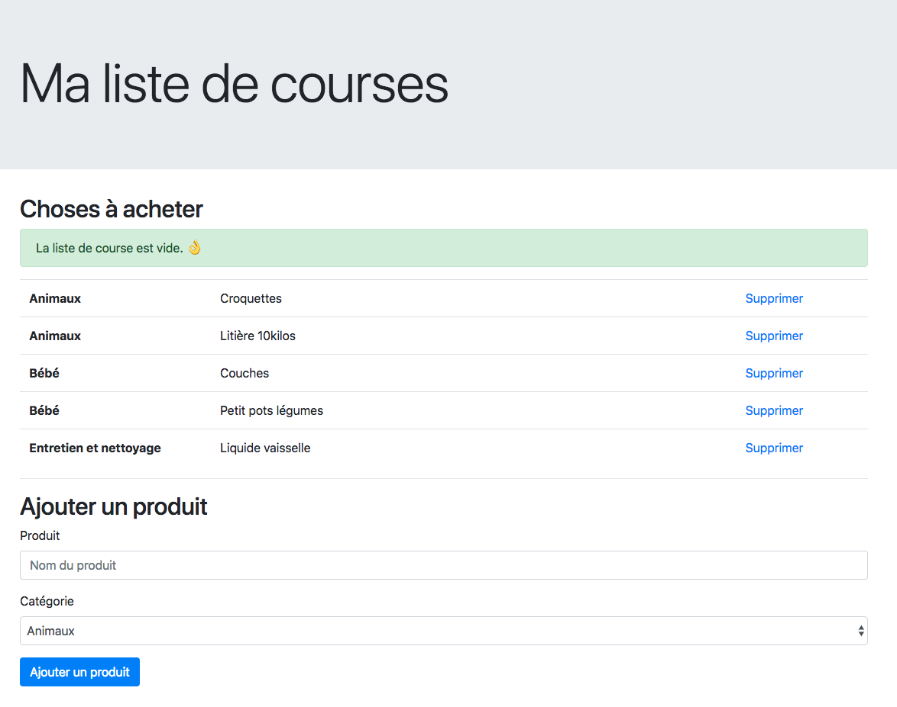

# Challenge "Ma liste de course"

L'objectif est de gérer une liste de course simple via une base de données MySQL.

## Le template

Vous utiliserez le template [courses.html](./templates/courses.html).

## L'objectif

Vous ferez un script unique `courses.php` avec tout le code dedans.

#### 1 - Créer une table `shopping_list` dans votre base de données MySQL (directement dans PHPMyAdmin) :

```sql
DROP TABLE IF EXISTS `shopping_list`;

CREATE TABLE `shopping_list` (
  `id` int(11) unsigned NOT NULL AUTO_INCREMENT,
  `product` varchar(255) DEFAULT NULL,
  `category` varchar(255) DEFAULT NULL,
  PRIMARY KEY (`id`)
) ENGINE=InnoDB DEFAULT CHARSET=utf8;

INSERT INTO `shopping_list` (`id`, `product`, `category`)
VALUES
	(1,'Croquettes','Animaux'),
	(2,'Couches','Bébé'),
	(3,'Liquide vaisselle','Entretien et nettoyage'),
	(4,'Litière 10kilos','Animaux'),
	(5,'Petit pots légumes','Bébé');
```

#### 2 - Afficher le contenu de la table dans le tableau :

Les données sont triées par catégories, puis par nom, comme dans la template HTML.

On doit afficher "La liste de course est vide. 👌" si il n'y a rien dans la table.

#### 3 - Supprimer un élément de la liste

En cliquant sur le lien supprimer, on doit pouvoir supprimer la ligne en question dans la base de données.

#### 4 - Ajouter un élément dans la base de données

En utilisant le formulaire de la template, faire un INSERT dans la base de données.
